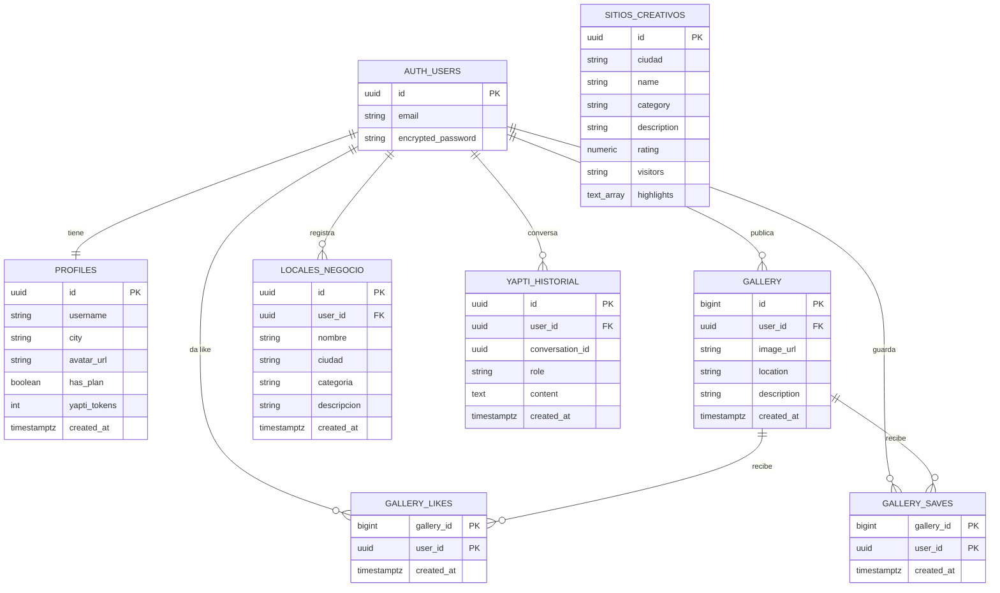
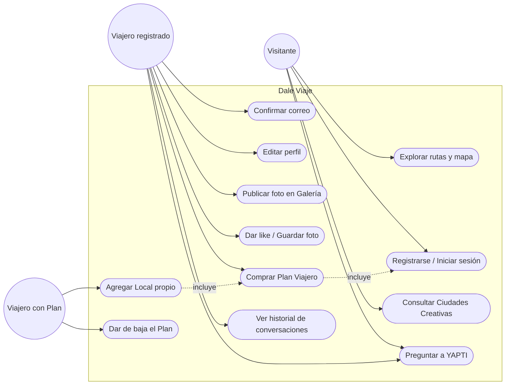
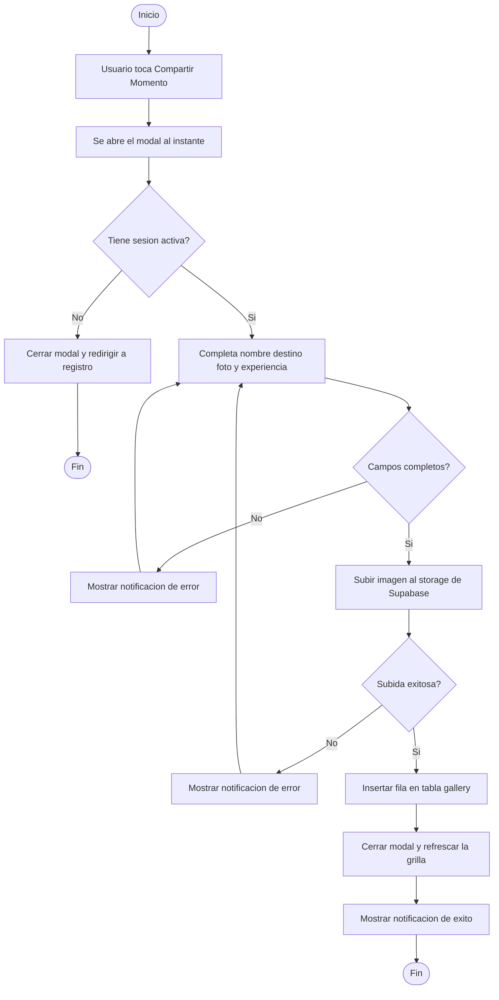
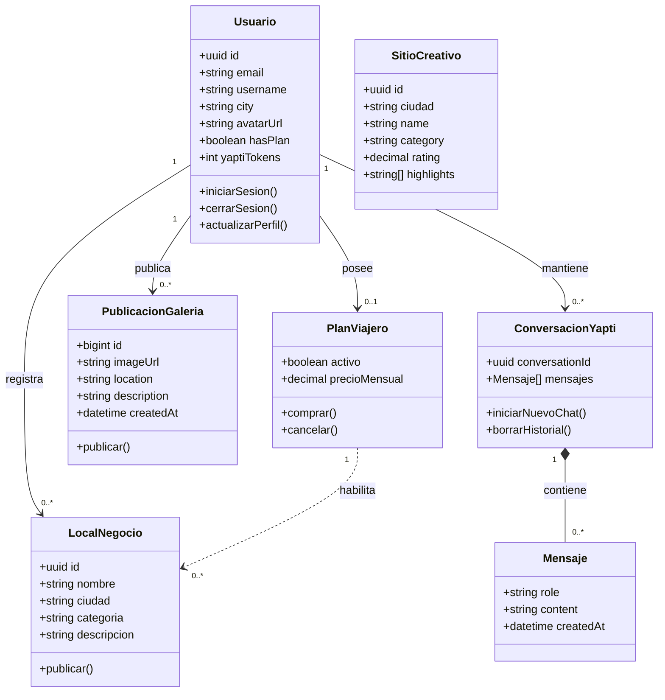

# Documentación de Diseño y Diagramas: Dale Viaje 🌍

Este documento contiene la especificación formal de la base de datos normalizada (3FN) y los tres diagramas UML del sistema **Dale Viaje**. Todos los diagramas están en formato [Mermaid](https://mermaid.js.org/), por lo que se renderizan automáticamente al ver este archivo en GitHub.

> La base de datos real vive en Supabase (PostgreSQL). El origen de verdad de cada tabla son los scripts en `supabase/` (`schema.sql` + `migracion_1..4_*.sql`), ejecutados en ese orden.

---

## 1. Diagrama Entidad-Relación Normalizado (3FN)

### Justificación de la normalización (3FN)

- **1FN**: todos los atributos son atómicos (por ejemplo, `highlights` en `SITIOS_CREATIVOS` es un arreglo nativo de Postgres, no una cadena de texto separada por comas).
- **2FN**: en las tablas con clave compuesta (`GALLERY_LIKES`, `GALLERY_SAVES`) no hay atributos que dependan solo de una parte de la clave; `created_at` depende de la combinación completa `(gallery_id, user_id)`.
- **3FN**: no hay dependencias transitivas. Por ejemplo, los datos de cada sitio turístico viven en `SITIOS_CREATIVOS` y no se repiten dentro de `LOCALES_NEGOCIO` (son conceptos distintos: catálogo curado vs. negocios de la comunidad).
- `PROFILES` es una **extensión 1 a 1** de `AUTH_USERS` (tabla gestionada por Supabase Auth): se separan porque `auth.users` es privada del esquema de autenticación y no debe mezclarse con datos de aplicación.

---

## 2. Diagrama de Casos de Uso

**Notas:**
- *Visitante* = cualquiera que entra sin haber iniciado sesión (tokens gratis limitados en YAPTI).
- *Viajero registrado* = tiene cuenta pero no compró el plan.
- *Viajero con Plan* hereda todos los casos de uso de "Viajero registrado", más los exclusivos del plan.

---

## 3. Diagrama de Actividades

Flujo completo de **"Compartir un Momento en la Galería"**, el caso de uso más representativo del sistema (combina autenticación, validación y persistencia):

---

## 4. Diagrama de Clases

Modelo conceptual de las entidades principales del sistema y cómo se relacionan (no es una traducción literal del JavaScript, que es procedural, sino el modelo de dominio subyacente):

